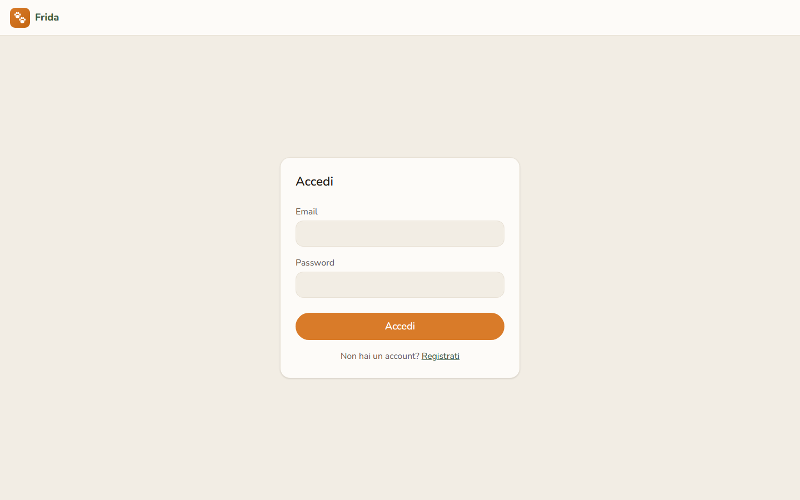
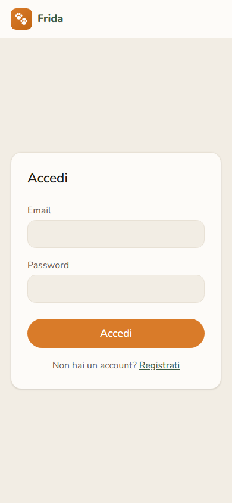
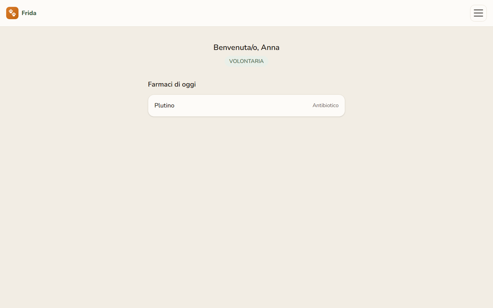
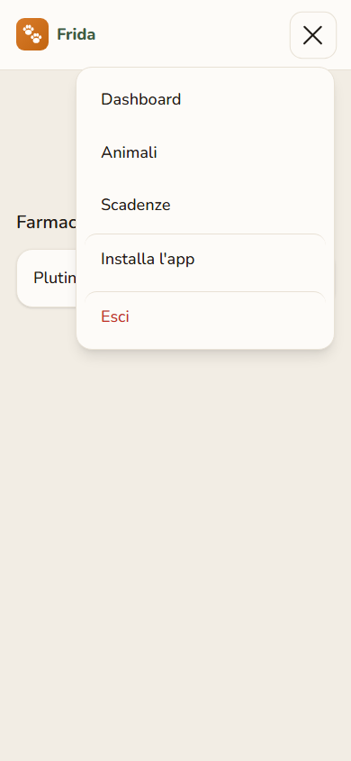
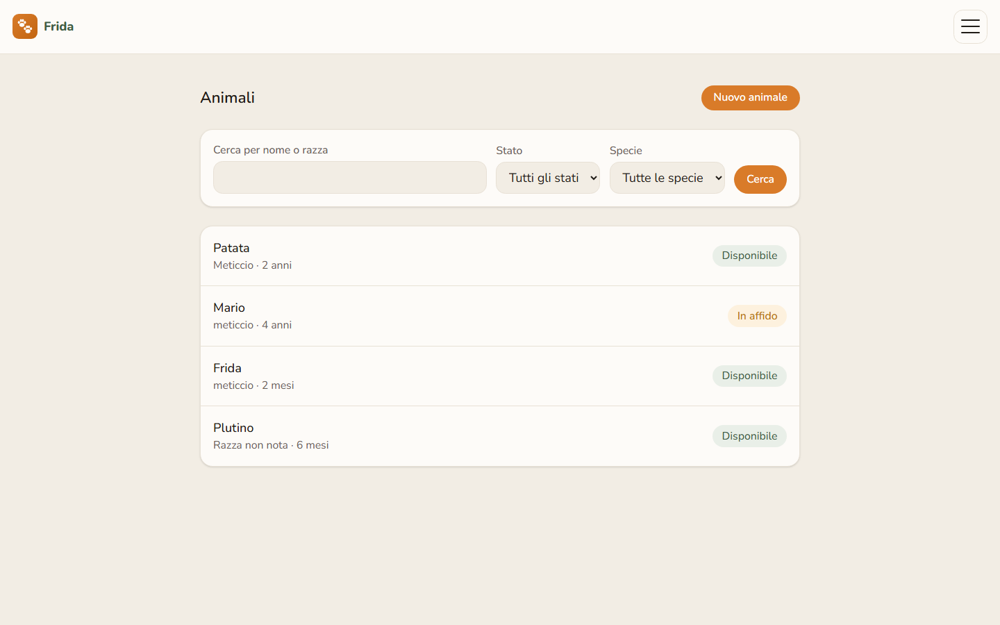
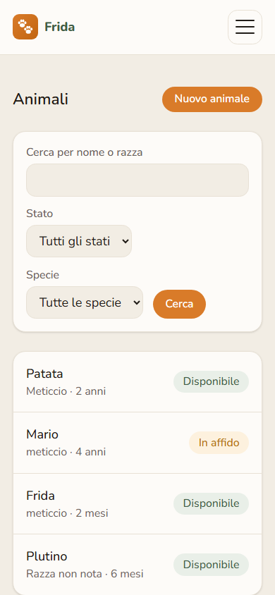
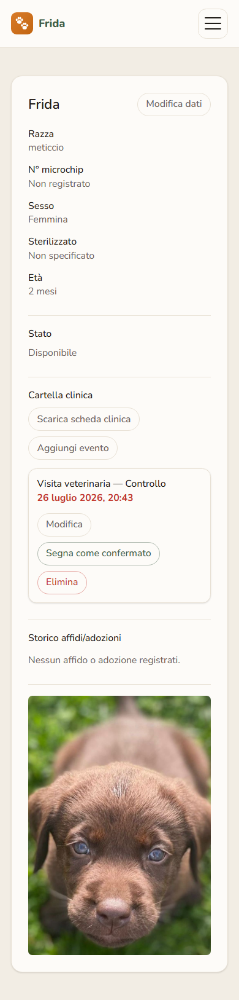
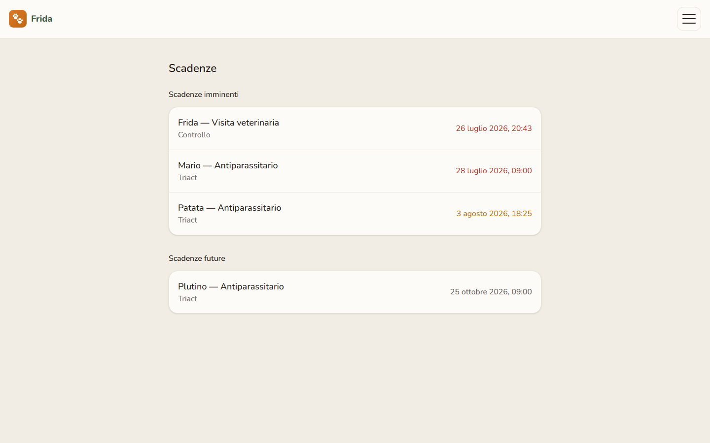
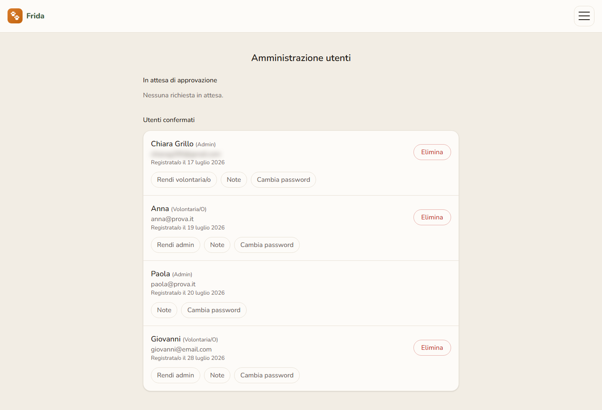

# 🐾 Frida

**Il gestionale per il tuo rifugio, pensato per chi passa la giornata tra i
canili, non davanti a un computer.**

Registro animali, cartella clinica, scadenzario dei richiami e ciclo
adozioni in un unico posto — caratteri grandi, un tocco per ogni azione,
pensato prima di tutto per lo smartphone.

<table>
<tr>
<td width="62%" valign="top">

</td>
<td width="38%" valign="top">

</td>
</tr>
</table>

## Per chi è pensato

Frida nasce per i rifugi che oggi si tengono insieme con quaderni, fogli
Excel e gruppi WhatsApp. Due tipi di persone la usano ogni giorno:

- **Le volontarie e i volontari**, spesso non giovanissimi e non abituati
  ad app o gestionali: registrano vaccini, cure e richiami dal telefono, in
  pochi tocchi, senza dover "capire l'informatica" per farlo.
- **Chi amministra il rifugio**: approva i nuovi account, decide chi va in
  affido o viene adottato, tiene traccia di chi ha in cura ogni animale —
  da desktop, quando serve una visione d'insieme.

Ogni schermata è pensata perché la persona più anziana del gruppo di
volontariato riesca a usarla senza chiedere aiuto.

## Cosa risolve

- **"Quando ha fatto l'ultimo vaccino Plutino?"** — cartella clinica per
  ogni animale, sempre consultabile, mai su un foglio che si perde.
- **"Chi doveva portare Mario dal veterinario questa settimana?"** — vista
  scadenze su tutto il rifugio, in rosso quello che è già scaduto.
- **"Chi ha in affido questo cane, e da quando?"** — storico affidi/adozioni
  per animale, dati sensibili visibili solo a chi amministra.
- **"Devo reinserire a mano l'antiparassitario ogni mese?"** — no: i
  richiami periodici si rigenerano da soli alla conferma.

## Screenshot

<table>
<tr>
<td width="66%" valign="top">

Dashboard — farmaci da somministrare oggi, su tutti gli animali del rifugio

</td>
<td width="34%" valign="top">

Menu a un tocco, pensato per il pollice

</td>
</tr>
</table>

<table>
<tr>
<td width="50%" valign="top">

Registro animali — ricerca per nome/razza, stato, specie

</td>
<td width="50%" valign="top">

Stessa vista, a piena larghezza sul telefono

</td>
</tr>
</table>

<table>
<tr>
<td width="42%" valign="top">

Dettaglio animale — anagrafica, cartella clinica, foto

</td>
<td width="58%" valign="top">

Scadenze — vista aggregata, imminenti in rosso/ambra

</td>
</tr>
</table>

Amministrazione — approvazioni, ruoli, password, senza self-service per chi amministra

## Funzionalità principali

### Accesso e ruoli
Due ruoli: **volontaria/o** (uso quotidiano) e **admin** (gestione utenti e
stati di adozione). I nuovi account nascono in attesa: un admin li approva
prima che possano operare. Sessione via Auth.js (JWT), verificata ad ogni
richiesta contro lo stato reale nel database — non solo contro il token, così
una disapprovazione o un cambio ruolo hanno effetto immediato.

### Registro animali e cartella clinica
Anagrafica (nome, specie, razza, numero di microchip, età calcolata dalla
data di nascita, sesso, sterilizzazione, foto) e cartella clinica per ogni
animale: vaccini, antiparassitari, visite, terapie continuative. Ogni
evento ha uno storico delle modifiche, e una scheda clinica
stampabile/scaricabile da consegnare a un veterinario o a chi affida/adotta
l'animale.

### Scadenze e richiami automatici
Vista aggregata su tutto il rifugio, evidenziata per urgenza (colore *e*
grassetto, non solo colore, per chi ha difficoltà a distinguere le tonalità).
I richiami periodici (es. antiparassitario mensile) si rigenerano da soli alla
conferma — non serve reinserirli a mano ogni volta.

### Adozioni e affidi
Ciclo a stati (disponibile → in affido/adottato → di nuovo disponibile) con
storico completo per animale. Dati sensibili della persona (cellulare,
documento) visibili solo agli admin.

### Amministrazione
Approvazione nuovi account, cambio ruolo, reimpostazione password (senza
self-service, per un pubblico a cui la gestione password crea spesso
confusione), note interne per admin. Guardie anti-lockout: nessuno può
eliminare o declassare se stesso.

### Installabile
Icona dedicata su cellulare ("Aggiungi a schermata Home") e computer
(Chrome/Edge, finestra a sé), con voce "Installa l'app" sempre nel menu.
Nessun funzionamento offline: cambia solo il modo in cui l'app si apre.

## Stack tecnico

- **Next.js 16** (App Router) + **React 19** (React Compiler) + **TypeScript**
- **Tailwind CSS v4**
- **PostgreSQL** via **Prisma 7**
- **Auth.js v4** (Credentials + sessione JWT)
- **react-hook-form** + **zod** (stessa validazione client e server)
- Icone e favicon generati via codice (`next/og`), nessun file immagine da mantenere
